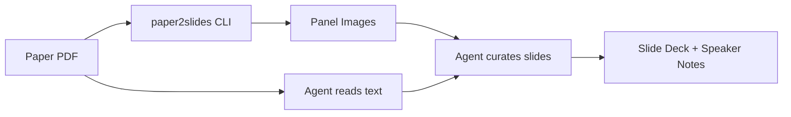

<div align="center">

# paper2slides

**Turn a scientific paper PDF into a presentation slide deck.**

An [Antigravity](https://github.com/google-deepmind/antigravity) / [Claude Code](https://docs.anthropic.com/en/docs/agents-and-tools/claude-code/overview) skill.

[](https://github.com/topics/antigravity-skill)
[](https://github.com/topics/claude-code-skill)
[](LICENSE)

</div>

---

## Overview

`paper2slides` is an agent skill that reads a scientific paper, extracts its figures, and produces a ready-to-present [Reveal.js](https://revealjs.com/) slide deck with speaker notes.

It works in two layers:

| Layer | Role | Implementation |
|-------|------|----------------|
| **Extraction** | Pull figures from the PDF, segment into panels | Python library (`paper2slides`) |
| **Curation** | Read the paper, select key figures, write slide content and speaker notes | The agent |

The extraction step is mechanical — it gives you all the raw material. The agent then does what a human presenter would: reads the paper, decides what matters, and builds a coherent narrative.

## Installation

### 1. Add the skill to your workspace

```bash
git clone https://github.com/inhyeoklee/paper2slides-skill.git

# Copy into your workspace
cp -r paper2slides-skill/skill/ YOUR_WORKSPACE/.agent/skills/paper2slides/
cp paper2slides-skill/workflow/paper2slides.md YOUR_WORKSPACE/.agent/workflows/
```

### 2. Install the Python library

```bash
cd paper2slides-skill/library
pip install -e .
```

Requires Python 3.9+ and installs PyMuPDF, Pillow, NumPy, Jinja2, and Click.

## How It Works



### Workflow

1. **Extract** — `paper2slides paper.pdf -o output/` pulls figures at 4× DPI and segments them into individual panels
2. **Read** — The agent extracts and reads the paper text to understand the structure, results, and narrative
3. **Curate** — The agent selects the most important panels, writes slide titles and captions, and composes speaker notes
4. **Verify** — The agent opens the deck in a browser to check rendering

## Usage

Tell the agent:

```
/paper2slides

Create a presentation from: path/to/paper.pdf
```

Or use the CLI directly for just the extraction step:

```bash
paper2slides paper.pdf -o ./output --serve
```

## What You Get

- **16:9 Reveal.js deck** with light/dark themes
- **Speaker notes** embedded in each slide (press `S` to view)
- **Interactive figures** — zoom, pan, and lightbox on any image
- **Standalone speaker notes** as a separate HTML page with top nav, sidebar, talk script, slide cards, backup notes, quick reference, and Q&A
- **Presenter view** with current notes plus next-click/next-slide preview
- **Overview mode** with main slides and hidden backup slides separated
- **Editable deck and notes** with browser autosave, reset, and downloadable edited HTML
- **MathJax support** for display and inline equations in deck, notes, and presenter view
- **Settings panel** for theme, font, font scale, figure scale, transitions, progress, and controls

## Project Structure

```
paper2slides-skill/
├── skill/                       # → .agent/skills/paper2slides/
│   ├── SKILL.md                 #   Agent instructions
│   └── resources/
│       ├── template_shell.html  #   Reveal.js template
│       ├── slides.css           #   Presentation styles
│       ├── speaker_notes_template.html
│       └── speaker_notes_template.md  # legacy markdown reference
├── workflow/                    # → .agent/workflows/
│   └── paper2slides.md         #   /paper2slides command
├── library/                     # → pip install -e .
│   ├── pyproject.toml
│   └── src/paper2slides/
│       ├── cli.py               #   CLI entry point
│       ├── extractor.py         #   PDF figure extraction
│       ├── segmenter.py         #   Panel segmentation
│       ├── generator.py         #   HTML generation
│       └── templates/
├── LICENSE
└── README.md
```

## Contributing

PRs welcome. Some directions:

- PPTX / Google Slides export
- OCR-based panel label detection
- Multi-paper decks

## License

MIT
